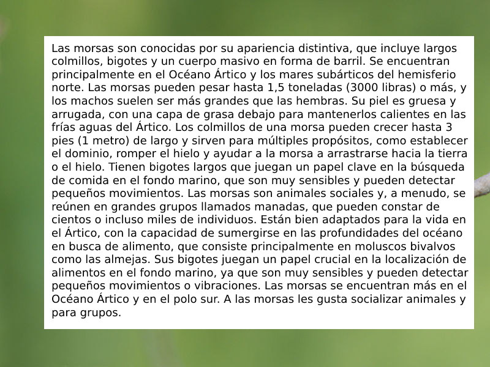

# VisualTranslator

## How to run

```cmd
#(optional)
conda create --name visualtranslator python=3.8 
conda activate visualtranslator
# Install packages
pip install -r requirements.txt --user

# Run algorithm
cd src
python main.py --imgfile training1.png
```

## Example result



    >> python main.py --imgfile training1.png

    [Extract Spanish text from Image]:
    Las morsas son conocidas por su apariencia distintiva, que incluye largos colmillos, bigotes y un cuerpo masivo en forma de barril. Se encuentran principalmente en el Océano Ártico y los mares subárticos del hemisferio norte. Las morsas pueden pesar hasta 1,5 toneladas (3000 libras) 0 más, los machos suelen ser más grandes que las hembras. Su piel es gruesa arrugada, con una capa de grasa debajo para mantenerlos calientes en las frías aguas del Ártico _ Los colmillos de una morsa pueden crecer hasta 3 pies (1 metro) de largo y sirven para múltiples propósitos, como establecer el dominio, romper el hielo y ayudar a la morsa a arrastrarse hacia la tierra el hielo. Tienen bigotes largos que juegan un papel clave en la búsqueda de comida en el fondo marino, que son muy sensibles y pueden detectar pequeños movimientos Las morsas son animales sociales y, a menudo, se reúnen en grandes grupos Ilamados manadas, que pueden constar de cientos incluso miles individuos. Están bien adaptados para la vida en el Ártico, con la capacidad de sumergirse en las profundidades del océano en busca de alimento, que consiste principalmente en moluscos bivalvos como las almejas_ Sus bigotes juegan un papel crucial en la localización de alimentos en el fondo marino, ya que son muy sensibles y pueden detectar pequeños movimientos vibraciones. Las morsas se encuentran más en el Océano Ártico y en el polo sur. las morsas les gusta socializar animales y para grupos_ de
    [Translate Spanish to English]:
    Walruses are known for their distinctive appearance, which includes long fangs , whiskers and a massive barrel-shaped body. They are mainly found in the Arctic Ocean and the subarctic seas of the Northern Hemisphere. Walruses can weigh up to 1.5 tons ( 3000 pounds ) or more , males are usually larger than females . Their skin is thickly wrinkled , with a layer of fat underneath to keep them warm in the cold waters of the Arctic _ A walrus's fangs can grow up to 3 feet ( 1 meter ) long and serve multiple purposes , such as establishing dominance , breaking ice, and helping the walrus crawl to land ice . They have long whiskers that play a key role in finding food on the seafloor , which are very sensitive and can detect small movements Walruses are social animals and often gather in large groups called herds , which can consist of hundreds or even thousands of individuals . They are well adapted for life in the Arctic , with the ability to dive deep into the ocean for food , consisting mainly of bivalve molluscs such as clams - their whiskers play a crucial role in locating food on the seafloor , as they are very sensitive and can detect small vibration movements. Walruses are found more in the Arctic Ocean and at 
    the South Pole. walruses like to socialize animals and for groups_ of
    [Summarize English text]:
    Their skin is thickly wrinkled , with a layer of fat underneath to keep them warm in the cold waters of the Arctic _ A walrus's fangs can grow up to 3 feet ( 1 meter ) long and serve multiple purposes , such as establishing dominance , breaking 
    ice, and helping the walrus crawl to land ice . They have long whiskers that play a key role in finding food on the seafloor , which are very sensitive and can detect small movements Walruses are social animals and often gather in large groups called herds , which can consist of hundreds or even thousands of individuals . They are well adapted for life in the Arctic , with the ability to dive deep into the ocean for food , consisting mainly of bivalve molluscs such as clams - their whiskers play a crucial role in locating food on the seafloor , as they are very sensitive and can detect small vibration movements.

